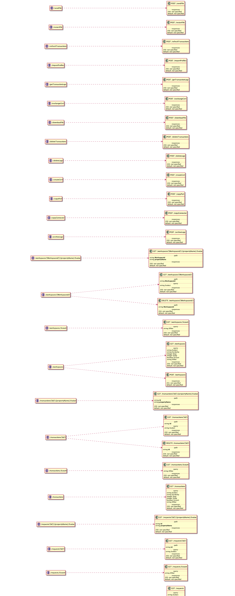

# n-Supply-Chain

 

## Documents of Trade

 

## Lex as a Service

### Concepts
- Units of Execution
- Units of Agreement
- Units of Afferent
- Units of Efferent
- Units of Lexigram

- Controlled Natural Language = Jurisdictional Grammar (see [Burgess](https://github.com/freight-trust/burgess) )
- Afferent = Towards 
- Efferent = Away

## Blocks as `units of agreement`

A couple of specific block linkages are stated as facts. Two general principles of block chaining based on such linkages are stated as "conclusion if condition" rules. (The diagrams' color coding is extended to the symbolic form by using green for facts and their rule-condition counterparts while using red for rule conclusions and their -- recursive -- rule-condition counterpart.)

Facts
"Block1 links to Block2."
"Block2 links to Block3."
Rules
"x chains to y if x links to y."
"x chains to z if x links to y and y chains to z."

Facts are *primitives* (i.e. not containing variables) that apply
a predicate to arguments

to Block1 followed by Block2 and
to Block2 followed by Block3 

Rules are of the form `conclusion :- condition` (i.e. containing variables), with the Prolog-like (symbol) infix `":-"` corresponding to the above "if".

This consittutes the extent of which RuleML is applied to the `TradeDocs` system, a basic primitive set for `rule-conditions`

